# Sankey visual documentation

## Data filed buckets

The Sankey has several buckets. There are Source, Destination, Source labels, Destination labels, Weight. Source and Destination buckets are required to display the diagram.

In this case the custom visual displays links between source and destination with same links weights.

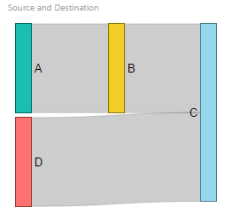

Weight data bucket allows setting weights for each link.

With data on weight data field, the custom visual draws the links with different sizes. And size of link depends on value of data

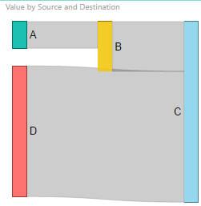

With source and destination labels, you can construct the Sankey with duplicated nodes. To do so you just need to give different names for nodes but with the same labels.

In this sample, D node draws twice

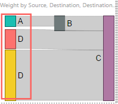

## Sankey properties panel

*Data labels* properties provides settings for configure node labels

_Color_ - defines text color of label

_Text size_ - defines text size of label

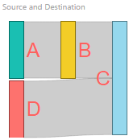

*Data link labels* properties provide settings for configuring link labels.

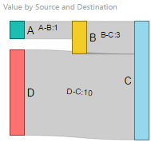

_Color_ - defines text color of label

_Text size_ - defines text size of label

_Force display properties_ - changes the behavior of labels in the intersection. Labels will be hidden if there's no room to fit them. If Force display option is enabled, the custom visual displays the label in any way 

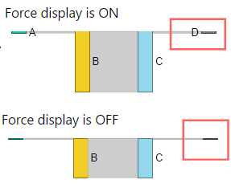

_Display units properties_ - changes display units in link labels and tooltips

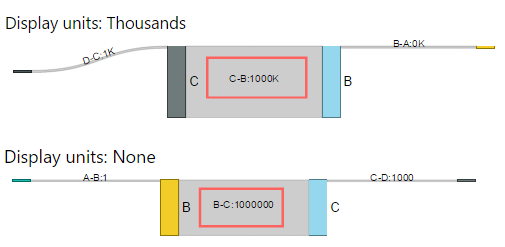

*Links* properties define colors for each link

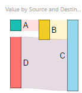

### Scale settings

Scale settings allow configuring the scale properties of the chart.

Provide min optimal height property - the chart draws all nodes with minimal height to supply convenient size. It can be useful if a distribution of weight values very hight. For example, the minimal value in a data set is 1 and maximum value in a dataset is 1 million.

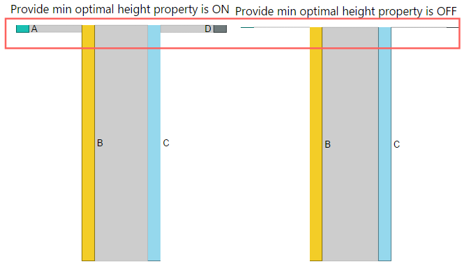

Enable logarithmic scale - this option switches linear scaling to logarithmic. With this options, the chart smooths values distribution 
in a dataset.

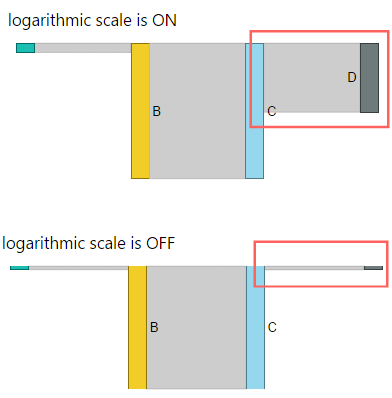

## Cycles

If a dataset contains the nodes with a link to itself or graphs with cycles, the visual duplicates one of the node to "break" cycle and draws twice same node.

On the chart, you can see that node B was drawn twice.

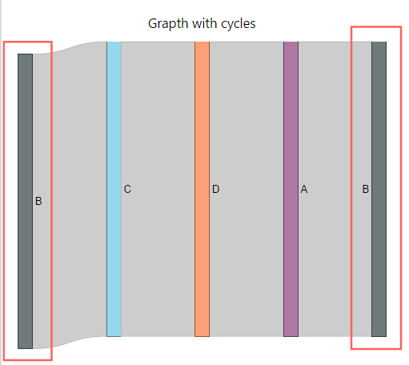

On the this chart, the node T has self-link and was drawn twice too.

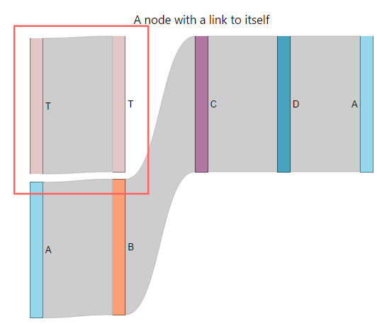

## Drag & drop

Sankey visual allows moving nodes to any position of viewport by mouse. After moving nodes to different positions, the visual saves the state and draws node in same positions after resizing the visual or reloading the report.

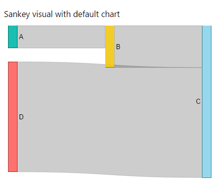

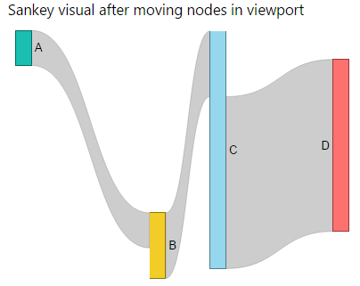