# Sankey visual documentation

[Data fields](#data-fields)

[Sankey format panel](#sankey-format-panel)

[Links](#links)

[Nodes](#nodes)

[Scale settings](#scale-settings)

[Cycles](#cycles)

[Drag & drop](#drag--drop)

[Reset button](#reset-button)

## Data fields

The Sankey has several buckets. There are Source, Destination, Source labels, Destination labels, Weight. Source and Destination buckets are required to display the diagram.

In this case the custom visual displays links between source and destination with same links weights.

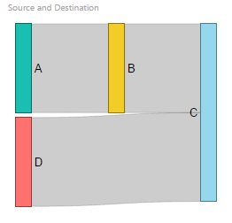

Weight data bucket allows setting weights for each link.

If Weight data field is filled, the custom visual draws the links with different sizes. And size of link depends on value of data

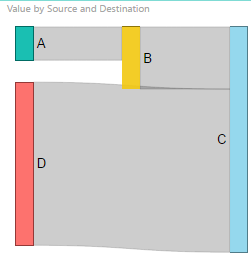

If Source and Destination fields are filled, you can construct the Sankey with duplicated nodes. To do so you just need to give different names for nodes but with the same labels.

In this sample, D node is rendered twice.

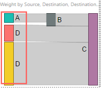

## Sankey format panel

*Data labels* properties provide settings to configure node labels

_Color_ - defines text color of label

_Text size_ - defines text size of label

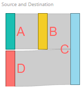

*Data link labels* properties provide settings for configuring link labels.

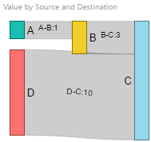

_Color_ - defines text color of label

_Text size_ - defines text size of label

_Force display properties_ - changes the behavior of labels in the intersection. Labels will be hidden if there's no room to fit them. If Force display option is enabled, the custom visual displays the label in any way 

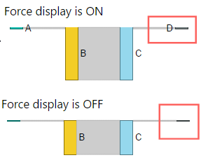

_Display units properties_ - changes display units in link labels and tooltips

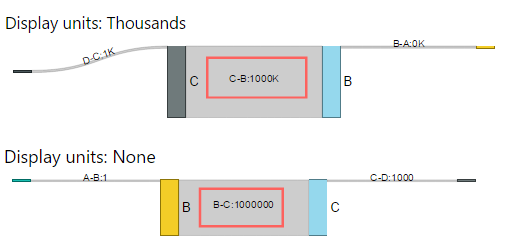

### Links

*Links* properties define how the links are colored and outlined.

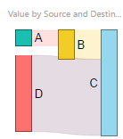

_Color_ - defines the color of the links. The *All* item applies a single color to every link; expand the item list to override the color of an individual link. The *All* color also accepts conditional formatting, so link colors can be driven by a rule or a measure.

_Match node colors_ - paints each link with the color of one of the nodes it connects instead of the link color. While this option is on, the link color picker is disabled.

_Match color to_ - appears when *Match node colors* is enabled and selects which end of the link supplies the color: *Source* or *Destination*.

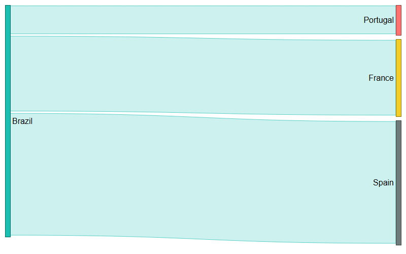

_Outline_ - draws a border around the links. *Show outline* turns the border on or off, _Color_ sets the border color and _Width_ accepts values from 1 to 5 pixels. The outline applies to every link, so these options are available on the *All* item only.

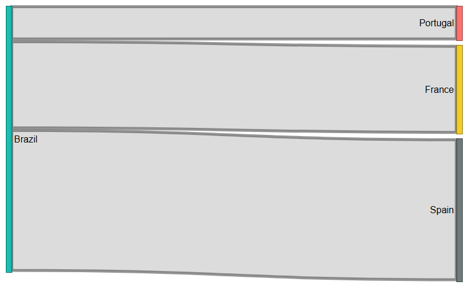

In high contrast mode the visual takes its colors from the system theme, so the link color and the outline color pickers are disabled.

### Nodes

*Nodes* properties define the color and the width of the nodes.

_Color_ - the *All* item colors every node; expand the item list to override the color of an individual node.

_Width_ - the width of the node rectangles in pixels. It applies to every node, so it is available on the *All* item only.

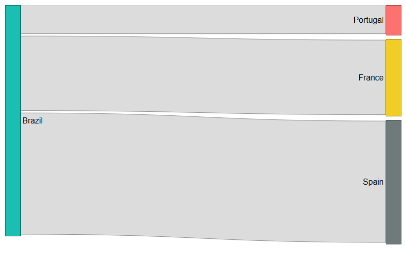

### Scale settings

Scale settings allow configuring the scale properties of the chart.

Provide min optimal height property - the chart draws all nodes with minimal height to supply convenient size. It can be useful if a distribution of weight values very hight. For example, the minimal value in a data set is 1 and maximum value in a dataset is 1 million.

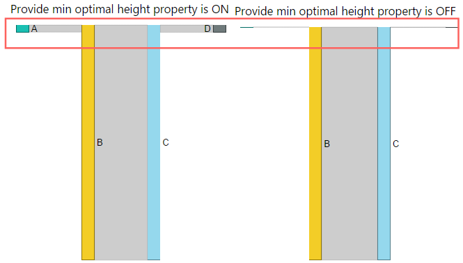

Enable logarithmic scale - this option switches linear scaling to logarithmic. With this options, the chart smooths values distribution 
in a dataset.

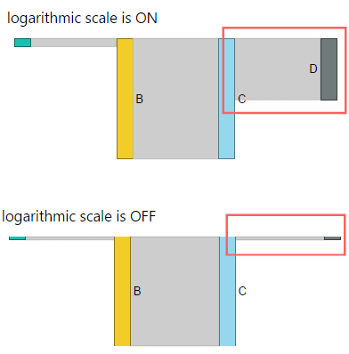

## Cycles

If a dataset contains the nodes with a link to itself or graphs with cycles, the visual duplicates one of the node to "break" cycle and draws the same node twice.

In the chart, you can see that node B was drawn twice.

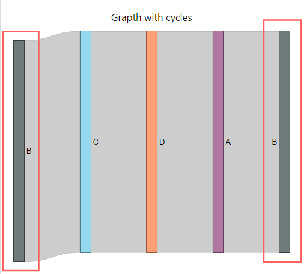

In this chart, the node T has self-link and was drawn twice too.

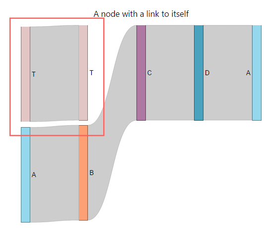

## Drag & drop

Sankey visual allows moving nodes to any position of viewport by mouse. After moving nodes to different positions, the visual saves the state and draws nodes at the same positions after resizing the visual or reloading the report.

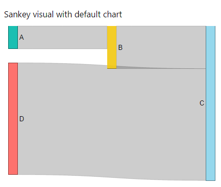

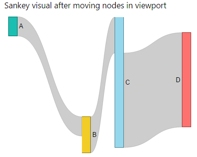

## Reset button

The *Sorting* card provides the *Reset button* options. *Show reset button* displays a **Reset** button that returns all nodes to their original positions, which undoes the moves made with drag & drop.

_Position_ - places the button in one of six places of the viewport: top, top center, top right, bottom, bottom center or bottom right.

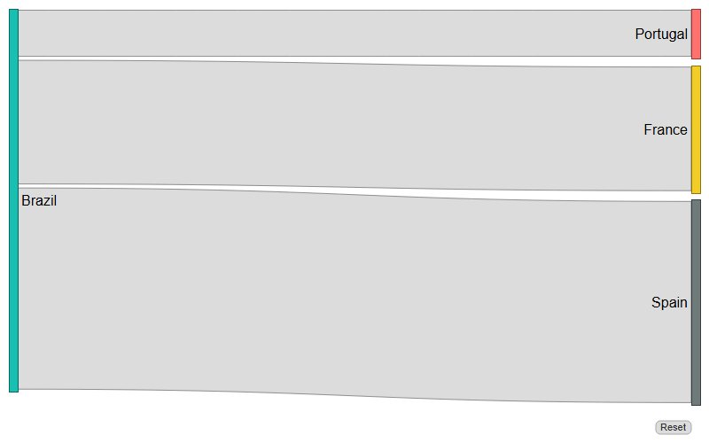
